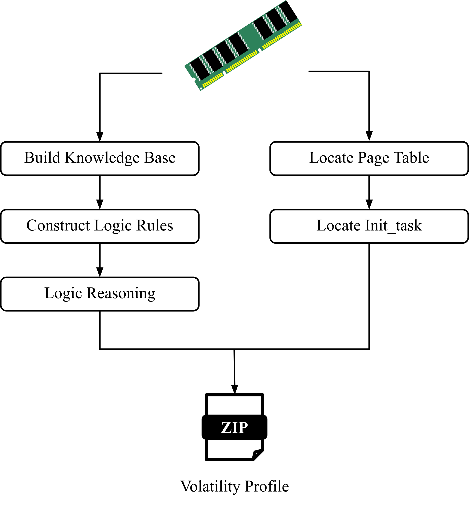

# Towards automatic kernel data structure layout recovering. 
In this document, we will talk about what is kernel data structure recovering and why we need it. 
Then we will talk about the existing approaches, motivation and challenges we are facing. 
Finally is the methodology and evaluation of our proposed approach.

## Problem statement:
Memory forensics is a technique that analyzes the raw memory dump and retrieves key information from raw bytes. One of the key components of memory 
forensics is the profile. Profile is a detailed description of data structure layout of the system under analysis. It guides memory forensics to 
retrieve useful information from raw memory dumps. Therefore, generating the profile for the target system is always the first step before memory forensics. 
However,  this is a non-trivial step for reasons. First of all,  the layout information is lost during compilation, and the commonly used method to build 
the profile is to compile a toy module in the target system and collect debug symbols from the compiler. But this is not possible in many cases. For example, 
when analyzing the memory dump from a server, the server may not have the required toolchains installed. Thus makes it impossible to build the profile. 
Even if it has the required toolchains installed, it could also fail because these kinds of methods (e.g. building a toy module and collecting debug symbols) 
are specifically designed for kernels and may need to change according to the kernel upgrades. Secondly, kernels are configurable and designed for 
various devices and architectures. The same version of linux kernel may emit different data structure layouts for different distributions.
For example, linux kernels have more than 60 marcos only for task_struct. Users can also customize their own kernel builds by disabling or enabling 
configurations according to their needs. Thirdly, in many cases of memory forensics, the only given information is the memory dump itself and it is 
impossible to boot the target system up and build the profile. To solve the aforementioned problems, we propose to automatically build a memory forensics profile from 
a memory dump. 

## The scope and assumption:
We assume the structure layout randomization is disabled. The only input or information we have is the memory dump. We do not rely on any global symbol, 
but if we have that information, it can facilitate the process. It is resilient against KASLR, which means that even if the structure and objects are 
randomized in the memory, we can still figure the layout of data structures.

## Related works:

## Methodology:
### Parsing the image headers
Given a memory dump, the first step to do is parsing the headers to know where the memory region begins. For instance, the memory images dumped 
by qemu have different header information. By parsing the headers, one can know how to read the physical address in the memory dump

### Locating page table
One of the most important pieces of information in a memory dump is pointers. To collect pointers in raw memory and translate them into physical addresses, 
we need to find the page table first. To locate the page table in raw memory bytes, we proposed a signature-based searching approach. For the first two 
levels of kernel page tables, we identified certain signatures for the last 7 bits in each page table entry: the dirty bit, access bit, user/supervisor 
bit and present are always set to 1, the rest are set to 0. We replay the address translation process when searching for the signature. For one potential
first level page table, we search the signature in each page table entry in that page. Upon finding a candidate entry, it  goes to the pointed page table 
and searches the signature in page table entries in the next level page table. For the last two levels of page tables, we only check whether the present 
bit is set in each entry. 

### Logic reasoning
We utilize logic programming to recover the layout of data structure from a raw memory dump. In general, there are three steps. 
* __Build the knowledge base.__
The logic reasoning process is an optimized search over finite domain. It reduces the search space using pre-defined logical rules. 
So the first step is to build a search space, which is also called a knowledge base in logic programming. In our case, the knowledge base 
contains information that we can get from a raw memory dump. We choose three types of basic information, pointers, numbers and strings. 
Starting from an initial address, we scan the memory dump for potential pointers, numbers and strings, and save the content and offset into the 
knowledge base. To identify a pointer, we check if we can make an address translation using that virtual address. If the value is zero, we also 
assume it is a null pointer.  To identify a number (e.g. integer or long), we use some heuristics such as numbers are relatively small in the memory. 
To identify a string of interest, which is a process name, we check whether each of its ascii values is in a valid range. Overall, the knowledge 
contains information such as <offset, content>. The offset is the distance from the initial searching address and the content is the value at that 
offset. Note that the knowledge base may contain false positives. For instance, zero can be identified as a pointer and an integer; a string may 
be just a random string in the memory dump. The results show that our approach can still work with high precision and recall.

* __Construct logic rules.__
The logic rules are used to prune unsatisfiable entries in the knowledge base and reduce the search space. We build the logic rules by learning 
invariants in kernel data structures across a large variety of kernel versions. Specifically, we download 10 versions of linux kernel and perform 
simple string matching (reverse diffing) to find the common parts in kernel data structures. By doing so, we can collect invariants of fields and 
their offsets in kernel data structures that always hold in 10 versions of linux kernel. Then we encode the invariants into logic rules. In general, 
the logic rules describe the field invariants. For example, there is one pointer *mm in task_struct which points to another mm_struct and there is a 
successive pointer *active_mm which also points to a mm_struct, the offset between these two fields is 8.

* __Logic reasoning.__
In general, there are two types of rules, property rules and recursive rules. 

